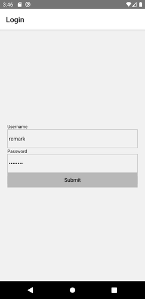
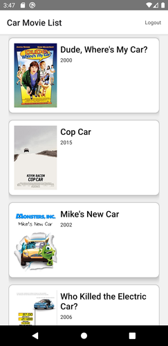

# Remark Car (Accessment)





Only Android is supported currently. iOS may work but there is no guarantee.

Test Credentials:
Username: remark
Password: testtest

Some remarks/assumptions that is made during the accessment.

## Running

```
cd RemarkCar
yarn
yarn android
```

## Architecture

### Babel

[MobX has stated to change the Babel config as follows](https://mobx.js.org/installation.html#use-spec-compliant-transpilation-for-class-properties) but changing it would cause the app to crash during startup. Not sure why, but removing it will fix the app so it is omitted at the moment.

### State Management

As I mainly work on `redux` and `redux-saga` stack for state management I am not familiar on `mobx` stack. Therefore I will be only following the styles/practices written in the official `mobx` documentation.

#### Global State

Since the accessment project is small, all states would be only splitted into 2 parts: Authentication (Auth Domain) and Movies (Business Domain).

The state mobx instance are then saved and passed inside React using React Context.

### Folder Structure

All Javascript sources would reside in `src` folder. Inside the folder there are some preallocated folders:

`assets` - Place static assets (eg. images/vectors) here.
`common` - Commonly/Globally used utils/codes here.
`context` - Globally used application logic context (eg. auth) here.

### ESLint

ESLint is working out of the box with Visual Studio Code (with extension installed).

`no-unsafe-optional-chaining` is explicitly turned off due to some error came out with it (no time to investigate).

### Debugging

Not sure what is the recommended way to debug in MobX stack. normally I use `react-native-debugger` but it is a bit specialized for Redux stack.

For this assessment Flipper is used instead.

## Login

The question mentioned without styling, but I have applied some minimal styles that make things look better.

## Movie List

Using `axios` as the API client.

Things that are working:
- Paging when scroll to bottom
- Error handling (only very basic level)
- Show end of list text when scroll to the end (after last page)

## Production

The keystore is stated in clear text in `build.gradle` with keystore commited to the repository, to simplify building of production apk.

To build one you can simply run this in the project directory.

```bash
cd android
./gradlew assembleRelease
```

Please note that this is NOT A PRODUCTION ACCEPTABLE PRACTICE and is only adopted for project simplicity.

Anyway the producted `.apk` still does not work (it just crash right away). Have to investigate deeper as it is working fine in debug mode.

## Misc.

The behind part (car movie list) code may be a little bit rough as I ran out of time. :(
